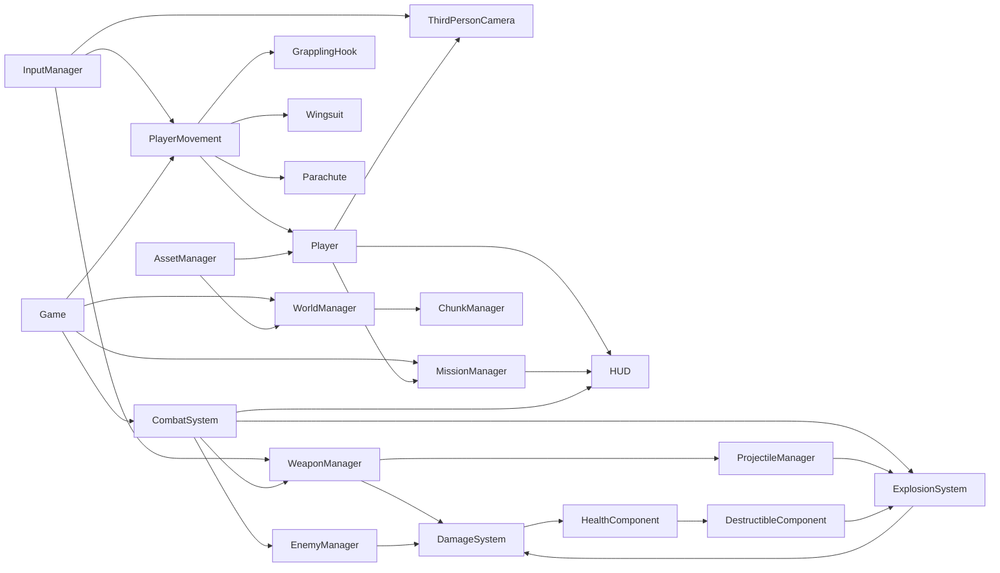

# Cala Ventra — Architektur

## Ziel und Grenzen

Stand 8. September 2026: Die Welt besitzt drei unabhängige Basen und ein separates ziviles Umgebungssystem. `src/data/bases.ts` definiert IDs, Namen, Positionen, Wachen und Tanks. `BaseManager` verwaltet Zerstörungsziele und sechs Sekunden Gebietssicherung; `CombatSystem` vergibt die Belohnung und aktiviert Flaggen/Nachschub/Bewohner. Fortschritt bleibt beim Spieler-Respawn bestehen, wird beim Einsatz-Neustart oder Neuladen zurückgesetzt. `WorldExpansion` baut neue Areale und dem Terrain folgende Strassen. `LivingWorld` steuert zwölf Zivilisten, sechs Bewohner nach Befreiung und zwei Verkehrswagen. `WorldMap` zeigt den aktuellen Gebietszustand. Diese Module ersetzen die ursprüngliche fest eingebaute Orbis-Abschlussbedingung.

Terrainfläche jetzt 800 × 800 m, Landellipse ungefähr 680 × 710 m. Insgesamt 20 Gegner und acht Tanks. Gegner ausserhalb von 260 m pausieren, zivile Figuren ausserhalb von 150 m werden inklusive Bewegungsanimation deaktiviert. Gebäude und Missionsziele bleiben geladen; Dekoration verwendet weiterhin Chunk-Distanzaktivierung. Zivilisten verwenden vorgegebene Fusswege und sind keine Damage-Ziele. Verkehr ist Umgebungssimulation ohne Fahrzeuginteraktion oder Fahrzeugschaden. Kein allgemeines Navmesh, kein vollständiges Streaming und kein persistentes Savegame.

Eigenständiges schnelles Third-Person-Actionspiel. Nika Serrin erkundet die Insel Cala Ventra; das Vektor-Direktorat kontrolliert die Relaisstationen. Eigene Topografie, Geschichte und Missionen. Keine Inhalte anderer kommerzieller Spiele.

Zuerst ein überprüfbarer Movement-Slice, danach Kampf und Befreiung. Browser/Desktop, Maus und Tastatur, Vite/TypeScript/Babylon.js, rein statisch, kein Backend. WebGL2 als kompatibler Standard; WebGPU später als optionaler Renderer nach Messung. Keine Physikengine für die erste kinematische Bewegung nötig. Havok erst mit dynamischen Fahrzeugen/Trümmern, lokal gebündeltes WASM.

## Ordner und Verantwortlichkeiten

```text
src/
  main.ts                       Einstieg und verständliche Fehleranzeige
  core/
    Game.ts                     Composition Root, Lifecycle, fester Zeitschritt
    AssetManager.ts             GLB-Cache, Instanzen, Fortschritt, Fallback
    InputManager.ts             Action-Mapping, Pointer Lock, Edge-Trigger
    CharacterAnimator.ts        Maskierte Oberkörper-Clips und Überblendung
  data/
    assets.ts                   Einzige Quelle für Modellpfade
    config.ts                   Movement-, Kamera- und Weltparameter
    missions.ts                 Traversal-Route
    weapons.ts                  Damage, Feuerrate, Magazin, Streuung, Projektile
    enemies.ts                  Wahrnehmung, Angriffswerte, Spawnpositionen
    contracts.ts                Verträge für spätere Gameplay-Systeme
  player/
    Player.ts                   Kollisionskörper, Modell, Animation
    PlayerMovement.ts           Geschwindigkeit, Gravitation, Zustandswechsel
    PlayerState.ts              Exklusive Fortbewegungszustände
  camera/ThirdPersonCamera.ts   Orbit, Dämpfung, Kollisionsprüfung, Zoom
  abilities/
    GrapplingHook.ts             Raycast, Anker, Seil, Zugbeschleunigung
    Wingsuit.ts                  Lift, Drag, Pitch-Steuerung
    Parachute.ts                 steuerbarer Sinkflug
  world/
    WorldManager.ts             Region, Terrain, begehbare Bauwerke
    Terrain.ts                  deterministische Höhenfunktion und Mesh
    ChunkManager.ts             Distanzaktivierung und Dekorationsinstanzen
  missions/MissionManager.ts    datengetriebene Traversal-Prüfpunkte
  ui/HUD.ts                    HTML-HUD, Start, Pause, Einstellungen
  systems/                     HealthComponent, DestructibleComponent
  combat/                      CombatSystem, Weapon, WeaponManager, DamageSystem,
                               ProjectileManager, ExplosionSystem, CombatEffects, CombatAudio
  vehicles/                    später: Vehicle, CarController, HelicopterController
  ai/                          Enemy (kompakte FSM), EnemyManager
public/assets/
  characters/ vehicles/ buildings/ vegetation/ weapons/
  props/ environment/ effects/ audio/ licenses/
docs/ tests/ scripts/
```

Keine leeren Scheinimplementierungen für zukünftige Klassen. Verträge werden zentral beschrieben; konkrete Laufzeitmodule kommen erst mit ihrer spielbaren Phase.

## Kommunikation



Explizite Konstruktor-Abhängigkeiten für den kleinen Slice. Später typisierte Domain-Events (`damageApplied`, `entityDestroyed`, `baseLiberated`, `heatChanged`), keine globalen Variablen oder generischen Service-Locator. Render-Update ist von Simulation getrennt. Simulation 120 Hz, begrenztes Aufholen nach Tabwechsel; KI später 5–10 Hz, Streaming 2 Hz, HUD 10 Hz.

## Player-State und Übergänge

Exklusiv: `ON_FOOT`, `FALLING` (auch aufsteigender Sprung), `GRAPPLING`, `WINGSUIT`, `PARACHUTE`, `IN_VEHICLE` (reserviert).

* Bodenverlust/Sprung: ON_FOOT → FALLING.
* F mit gültigem Raycast-Anker: jeder Zustand ausser IN_VEHICLE → GRAPPLING.
* F erneut, Space, ungültiger/erreichter Anker: GRAPPLING → FALLING. Geschwindigkeit bleibt erhalten.
* C in der Luft: WINGSUIT an/aus. Q in der Luft: PARACHUTE an/aus. Wechsel beendet den vorherigen Ability-Zustand.
* Bodenberührung beendet Luftfähigkeiten. Landen → ON_FOOT.
* E nahe verfügbarem Fahrzeug: später IN_VEHICLE; sicherer Ausstieg übernimmt Fahrzeuggeschwindigkeit.
* Reset/Pause beendet Eingabeimpulse; Reset räumt alle Ability-Effekte auf.

Position und Geschwindigkeit gehören genau einem Controller. Abilities beeinflussen Geschwindigkeit, nie eigenständig Transform oder Kollision. Kameraposition ist nicht Spielerposition. Welt verwendet Meter, Sekunden und +Y oben.

## Implementierter Kampfstand

`CombatSystem` verbindet Module und zählt die Ziele des einen Basisauftrags. Es enthält nicht Ballistik, Waffenwerte oder KI-Verhalten. `Weapon` verwaltet Magazin, Reserve, Abklingzeit und Nachladen ohne Renderer. `WeaponManager` löst Eingabeimpulse aus, richtet die Mündung auf den Kamera-Raycast aus und prüft die Schusslinie erneut ab der Mündung. Waffenwechsel 1/2, R Nachladen; Rücktaste übernimmt den bisherigen Reset.

`DamageSystem` registriert stabile IDs, HP, Fraktion, Position und Radius. Schaden und Tod laufen über getrennte Callbacks. Gegner beschiessen einander nicht. Respawn gewährt drei Sekunden Immunität. Nach sieben Sekunden ohne Treffer regeneriert der Spieler; der SUV ist ein Nachschubpunkt. Tod stoppt die Fähigkeiten und führt nach zwei Sekunden zum Aussichtspunkt.

`ProjectileManager` hält maximal acht Raketen und prüft pro Update das vollständige zurückgelegte Segment. `ExplosionSystem` verarbeitet maximal vier der höchstens 32 vorgemerkten Explosionen pro Frame. Distanz reduziert Schaden; Gebäudedeckung reduziert ihn zusätzlich um 85 %. Drei rote Tanks besitzen je 80 HP, einen deaktivierbaren Kollisionsproxy und ein eigenes Wrack. Deren Explosionen können weitere Tanks auslösen. Effekte sind auf 128 Partikel und 24 Tracer begrenzt. Sounds entstehen lokal über Web Audio.

Die acht Wachen prüfen Wahrnehmung zeitversetzt etwa vier- bis fünfmal pro Sekunde. Bewegung und Beschuss laufen mit dem begrenzten Render-dt; das Spieler-Movement bleibt bei 120 Hz. Die aktive FSM umfasst PATROL, ALERT, COMBAT, SEARCH und RETURN. Kein Navmesh, keine bewusste Deckungswahl, keine Verstärkung. Die Alarmanzeige 0–3 ergibt sich aus suchenden/kämpfenden Wachen. Der aktuelle Befreiungsauftrag ist bewusst konkret: acht Wachen und drei Tanks. Eine verallgemeinerte Objective-Integration folgt später.

`CharacterAnimator` blendet Bewegung und Oberkörperhaltung getrennt. Eine Ziel-/Eigenschaftskombination wird nur von einer aktiven Ebene gesteuert, damit Laufanimationen die Schusshaltung nicht abschwächen. Schuss-, Interaktions-/Nachlade- und Todesclips stammen aus dem lizenzierten Charakterpack. Waffen ergänzen prozeduralen Rückstoss und Absenken beim Nachladen; Gegner kippen bei Treffern kurz zur Seite. Pause hält auch die Babylon-Animationen an. Hand-IK und Ragdolls sind nicht enthalten.

Massstab: Welt in Metern. Spielfigur 1,75 m; Soldat 1,82 m; SUV von 1,65 auf 2,15 m; Haus von 7 auf 11 m; Depot von 10 auf 16 m; Tanks von 5 auf 6 m. Collider folgen den gemessenen Modellgrenzen. Häuser stehen weiter auseinander; Tankabstände ermöglichen Kettenreaktionen, ohne Modelle zu überlappen.

## Damage-System: spätere Erweiterungen

`DamageEvent { sourceId, targetId, amount, type, hitPoint, impulse? }`; Typen bullet/explosion/collision. `HealthComponent` begrenzt HP, ignoriert Schaden nach Tod und erzeugt genau ein death-Event. `DamageSystem` löst Entity-ID auf, wendet Teamregeln und Damage-Multiplikatoren an. `ExplosionSystem` sucht Ziele räumlich, berechnet Distanzabfall, optional Sichtschutz, Schaden und Impuls. Kettenreaktionen über begrenzte Queue statt Rekursion. `DestructibleComponent`: INTACT → DESTROYED, Collider entfernen/ersetzen, Wrack zeigen, Mission benachrichtigen. Partikel und Trümmer gepoolt, kurze Lebensdauer, harte Obergrenzen. Waffenwerte sind Daten; Raketen/Granaten bewegen sich als Projektile mit segmentweisem Raycast gegen Tunneling.

## Vehicle-System

`Vehicle` besitzt ID, Entity-Transform, Seat, Health und VehicleSpec. `VehicleController` erhält normalisierte Throttle/Brake/Steer-Werte; Car/Boat/Helicopter sind austauschbare Controller. Modell ist nur Darstellung und beeinflusst keine Regeln. Ein Fahrer pro Sitz, Interaktionsradius, Ausstiegsplatz per Kollisionsprüfung, bei Zerstörung freigeben. Zunächst Arcade-Auto mit vereinfachtem Bodenkontakt; spätere Havok-Ray-Cast-Suspension ersetzt Controller, nicht Interaktion/Health. Enter/Exit und Tod müssen IN_VEHICLE atomar verlassen. Visuelle Radrotation entkoppelt von Physik.

## Enemy-System

`Enemy` = Transform + Health + Weapon + Wahrnehmung. `EnemyController` ist FSM: IDLE → PATROL → SUSPICIOUS → ALERT → COMBAT → SEARCH → RETURN. Sichtweite, Sichtkegel und LOS-Raycast; Geräusche tragen Ort und Stärke. Letzte bekannte Spielerposition statt Allwissen. Zeitversetzte Wahrnehmung, anfangs Wegpunkte und Hindernisvermeidung, später Navmesh. Deckung nur aus expliziten Cover-Points. `EnemyManager` begrenzt aktive Einheiten und Verstärkungen. Wanted 0–5 mit Cooldown und Entkommen-Regel; ein hoher Wert allein spawnt nicht unbegrenzt Gegner. Befreite Basis verhindert neue Feindspawns.

## World-Streaming

Deterministische Region-Definitionen mit persistenten Entity-IDs. Gelände und entfernte Silhouetten sind immer sichtbar; Vegetation in 96-m-Zellen wird distanzabhängig aktiviert. Pro Mesh/Material instanzieren, keine Modell-Downloads pro Baum. Erste kleine Region bleibt im Speicher; das ist Distanzaktivierung, noch kein vollständiges Streaming. Später `UNLOADED → LOADING → ACTIVE → DORMANT → UNLOADED`, asynchrone Budget-Queue, Abbruch/Generation-Token gegen verspätetes Laden, Hysterese (z.B. 220 m laden / 300 m entladen). Laden darf Simulationsschritt nicht blockieren. Aktuelle Grapple-/Missions-/Fahrzeug-Chunks pinnen. Zerstörungs-/Befreiungszustand lebt ausserhalb der Chunks und überlebt Entladen. Globale Instanzquellen bleiben im AssetCache, Chunk besitzt und entsorgt seine Instanzen.

## Reihenfolge und Abnahmekriterien

1. Vite + Insel + Third Person: TypeScript/Build, Boden/Kollision/Sprung/Kamera testen.
2. Lizenzierte Modelle und Bewegungsanimation: keine fehlenden Downloads, austauschbare Darstellung.
3. Grapple: Reichweite, Sichtlinie, Lösen, Momentum, Wandkollision.
4. Wingsuit: Sinkflug, kontrollierbare Geschwindigkeit, Landen.
5. Fallschirm: schnelle Übergänge, sicherer Reset. Traversal-Mission verbindet die Systeme.
6. Nach stabiler Bewegungsbasis: Auto, Waffen, Damage, Tanks, KI, Alarm, Basisbefreiung jeweils einzeln.

60 FPS ist ein Messziel, keine ungemessene Zusage. FPS, aktive Meshes und Geschwindigkeit anzeigen; Downloadgrössen dokumentieren. Build nach jedem zusammenhängenden Schritt. Regressionen für State-Übergänge und Bewegung unter unterschiedlichen Render-Raten; Browser-Smoke für tatsächliches WebGL/GLB-Laden. Kein pauschaler Beleg durch bestandenen TypeScript-Build.
